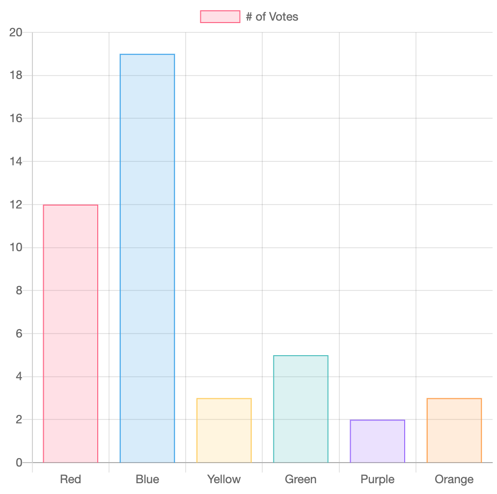

# chart.js

뷰 CLI는 뷰로 빠르게 프로젝트를 구성하고 프로토 타이핑을 하고 싶을 때 사용하는 CLI 도구입니다. 

## 설치

아래 명령어를 사용해 chart.js를 설치할 수 있습니다.

```bash
npm install chart.js --save
```

## chart.js 예제

chart.js를 사용하면 쉽고 빠르게 차트를 만들 수 있습니다. 아래의 예젠ㄴ bar chart를 화면에 그려줍니다.

```javascript
<canvas id="myChart" width="400" height="400"></canvas>
<script>
var ctx = document.getElementById('myChart').getContext('2d');
var myChart = new Chart(ctx, {
    type: 'bar',
    data: {
        labels: ['Red', 'Blue', 'Yellow', 'Green', 'Purple', 'Orange'],
        datasets: [{
            label: '# of Votes',
            data: [12, 19, 3, 5, 2, 3],
            backgroundColor: [
                'rgba(255, 99, 132, 0.2)',
                'rgba(54, 162, 235, 0.2)',
                'rgba(255, 206, 86, 0.2)',
                'rgba(75, 192, 192, 0.2)',
                'rgba(153, 102, 255, 0.2)',
                'rgba(255, 159, 64, 0.2)'
            ],
            borderColor: [
                'rgba(255, 99, 132, 1)',
                'rgba(54, 162, 235, 1)',
                'rgba(255, 206, 86, 1)',
                'rgba(75, 192, 192, 1)',
                'rgba(153, 102, 255, 1)',
                'rgba(255, 159, 64, 1)'
            ],
            borderWidth: 1
        }]
    },
    options: {
        scales: {
            yAxes: [{
                ticks: {
                    beginAtZero: true
                }
            }]
        }
    }
});
</script>
```

결과
